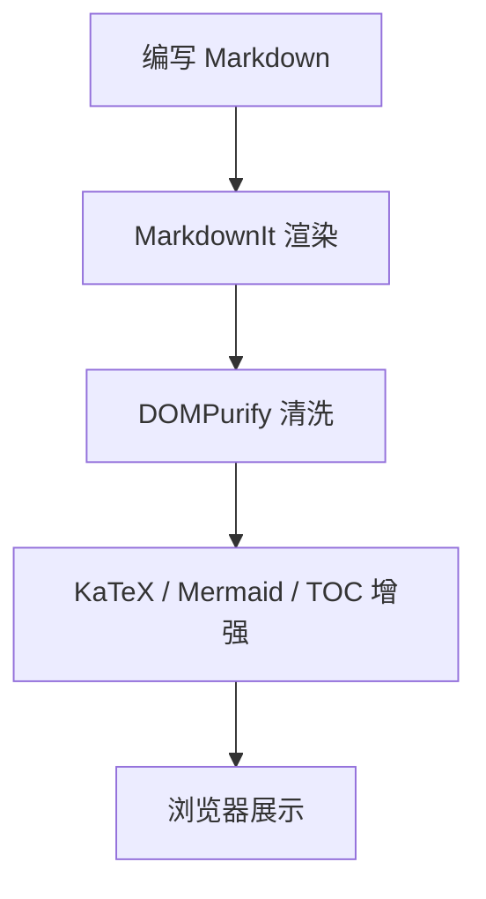

# Markdown 能力演示

这页用于演示当前文档站已经接入的常见增强能力，包括脚注、Mermaid、公式、提示块、任务列表与折叠块。

## 提示块

::: note
这是一个 Note 提示块，适合放背景说明或补充上下文。
:::

::: tip
这是一个 Tip 提示块，适合给出推荐写法或最佳实践。
:::

::: warning
这是一个 Warning 提示块，适合提醒兼容性、限制或容易踩坑的地方。
:::

::: danger
这是一个 Danger 提示块，适合强调破坏性操作或高风险变更。
:::

## 脚注

Markdown 现在支持脚注引用[^footnote-1]，也支持在同一段里写多个脚注[^footnote-2]。

## Mermaid



## 数学公式

行内公式示例：$E = mc^2$。

块级公式示例：

$$
\int_0^1 x^2 dx = \frac{1}{3}
$$

再来一个矩阵示例：

$$
A = \begin{bmatrix}
1 & 2 \\
3 & 4
\end{bmatrix}
$$

## 任务列表

- [x] 支持基础 Markdown
- [x] 支持 Mermaid
- [x] 支持数学公式
- [x] 支持脚注
- [ ] 后续可继续补全文搜索

## 折叠块

::: details 点击展开更多说明
这个折叠块适合放较长的补充内容、FAQ 或实现细节。

你也可以在里面继续写列表：

1. 第一项
2. 第二项
3. 第三项
:::

## 表格与代码高亮

| 能力 | 当前状态 | 说明 |
|------|----------|------|
| Mermaid | 已支持 | 使用 mermaid 代码块 |
| 数学公式 | 已支持 | 使用 KaTeX 自动渲染 |
| 脚注 | 已支持 | 使用 markdown-it-footnote |

```js
function sum(a, b) {
    return a + b;
}

console.log(sum(1, 2));
```

## 文档内链接

你可以直接跳到 [API 文档](../api.md) 或返回 [文档首页](../index.md)。

[^footnote-1]: 这是第一条脚注内容。
[^footnote-2]: 这是第二条脚注内容。